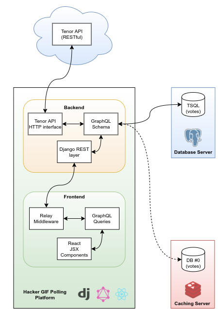

# Hacker GIF Polling Platform

A web application, for the sole purpose of enabling users to decide which hacking-related GIF is 
the most related to hacking activities, by voting on them via a polling mechanism. The GIF data, provided
by this platform, is sourced by the [Tenor API](https://tenor.com/gifapi).

## Getting started
Make sure that you have installed in your system the latest stable releases of the following tools:
* [Git](https://git-scm.com/);
* [Docker](https://docs.docker.com/);
* [Docker Compose](https://docs.docker.com/compose/);
* [Node.js](https://nodejs.org/);
* [Yarn](https://yarnpkg.com/lang/en/).

With the necessary installations completed, open a terminal, and execute the following commands:

### Cloning and building
To clone this repository, you must open an terminal and execute:

```bash
$ git clone https://github.com/guligon90/hacker-gif-poll.git
```

In order to run the building processes for the Docker containers that are configured in this project,
the `docker-compose` command must be executed, in the following manner:

```bash
$ cd hacker-gif-poll/
$ docker-compose -f docker-compose.yml build --pull
```

### Starting the application
You can start all of the three containers for the backend, frontend and the database at once, executing
the command:

```bash
$ docker-compose up -d

```

There is a dependency between all three containers, which is parametrized in the `docker-compose.yml` file.
That is, the backend container cannot start before the database. As for the frontend container, it can not 
start unless the backend container has already started.

To view the processes being executed, you can access the logs by executing:

```bash
$ docker-compose logs --follow
```

To quit the docker logging stream, just press `Ctrl+C`.

## Architecture

Based on client specifications, both on desired frameworks and functional requisites, the (proposed) architecture for
the polling plaftorm is ilustrated below.



The main components of the proposed structure can be recognized as:

* **Backend**: The service layer of the application. Its job is to create a communication interface between the platform and
the Tenor API, in order to extract, parse and later provide data to the remaining layers. Concerning frameworks and libraries,
the backend integrates:
  * Django: A python framework for web servers and constructing REST APIs, mostly;
  * Graphene-Python: A library that allows to implement GraphQL schemas, which is a graph-based data structure manager, which is
  superior to the REST architecture, since it reduces the number of API resources to one endpoint, and is more efficient in handling
  pagination and data relationship.
* **Frontend**: The platform's layer for the user interface. Here, the framework applied is Javascript-based: React.js, which is easily
integrable with GraphQL, and has a vast repository of components in the NPM library.
* **Database/Caching**: The data persistence layer. This part of the architecture is not definitively estabilished, since it was not
decided yet if the voting data associated to the GIFs must be permanently saved and, subsequently, associated to a user.
